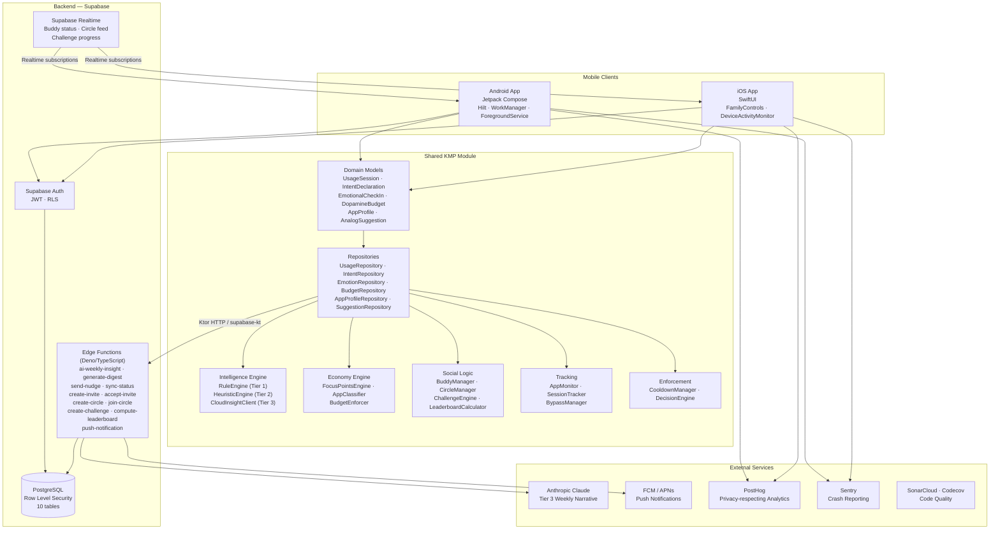
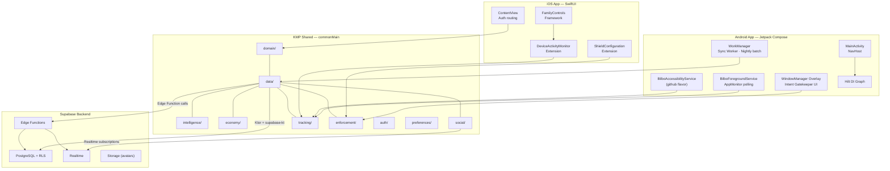
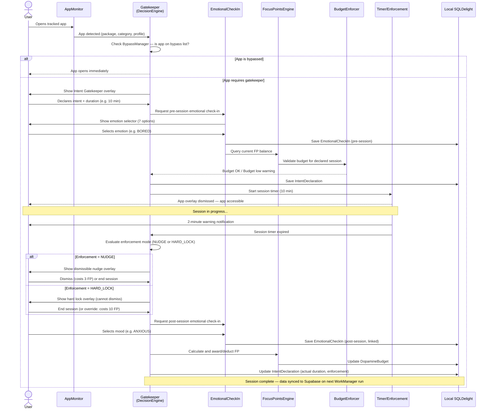
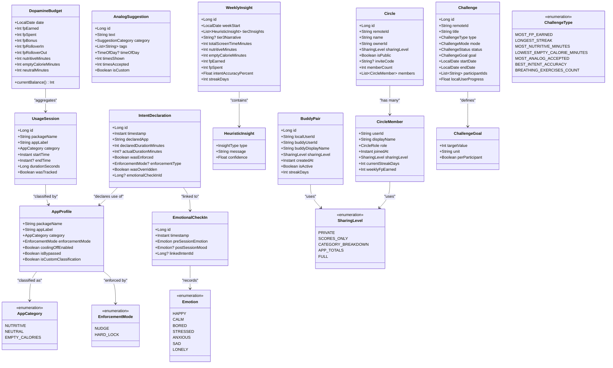
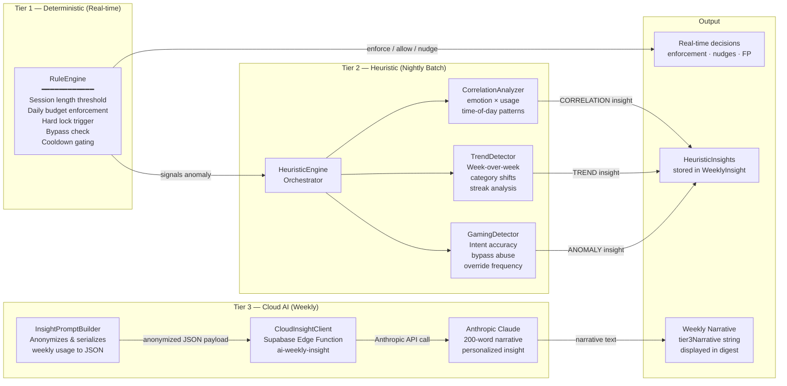
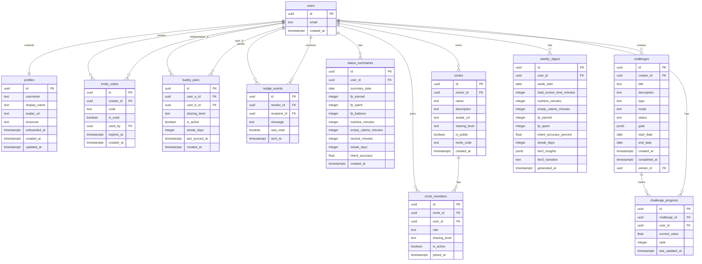

# Bilbo — Digital Wellness & Mindful Screen Time

> Take control of your screen time. Reclaim your focus. Protect your mental health.

[](https://github.com/Prekzursil/bilbo-app/actions/workflows/shared-tests.yml)
[](https://github.com/Prekzursil/bilbo-app/actions/workflows/android-ci.yml)
[](https://github.com/Prekzursil/bilbo-app/actions/workflows/ios-ci.yml)
[](LICENSE)
[](https://kotlinlang.org)
[](https://codecov.io/gh/Prekzursil/bilbo-app)

---

## What is Bilbo?

Bilbo is a Kotlin Multiplatform (KMP) digital wellness app for Android and iOS that helps you build mindful screen-time habits. Before you open a distracting app, Bilbo asks you *why* — then enforces your intention, tracks your emotional state, and rewards you for staying on track. It combines a Focus Points economy, social accountability, and a three-tier AI intelligence system to make conscious screen-time the default, not the exception.

---

## Architecture Overview



---

## Features

### Intent Gatekeeper
Before any tracked app opens, Bilbo intercepts with an overlay asking: *"What do you want to do, and for how long?"* Users declare their intent and duration. This single friction point breaks the habit loop of mindless app-switching and is at the core of how Bilbo changes behavior.

### Emotional Check-ins
At the start and end of each session, Bilbo captures your emotional state (Happy, Calm, Bored, Stressed, Anxious, Sad, Lonely). Over time, the AI correlates usage patterns with mood to surface insights like "You tend to feel more anxious after Instagram sessions that run over 20 minutes."

### Focus Points Economy
Bilbo uses a Focus Points (FP) currency system to gamify wellness:
- **Earn FP** by using nutritive apps, completing breathing exercises, accepting analog suggestions, and achieving accurate intent declarations.
- **Spend FP** by using empty-calorie apps beyond your declared intent.
- **Lose FP** for ignoring nudges or overriding hard locks.
- A daily baseline, streak bonuses, and rollover (50%) keep the system fair and motivating.

### Enforcement Engine (Nudge + Hard Lock)
Each app is classified as Nutritive, Neutral, or Empty Calories and assigned an enforcement mode:
- **Nudge** — a dismissible reminder that costs FP to bypass, creating conscious friction.
- **Hard Lock** — a full overlay that cannot be dismissed without a significant FP penalty, used for the most problematic apps.
- A **CooldownManager** prevents immediate re-entry after a session ends.

### Analog Alternatives
When Bilbo enforces a limit, it surfaces a curated suggestion from 10 categories (Exercise, Creative, Social, Mindfulness, Learning, Nature, Cooking, Music, Physical Gaming, Reading). Accepting a suggestion earns bonus FP and is tracked for intent-accuracy scoring.

### 3-Tier AI Intelligence

| Tier | Engine | Frequency | Description |
|------|--------|-----------|-------------|
| 1 | RuleEngine | Real-time | Deterministic rules: session length thresholds, daily limits, budget enforcement |
| 2 | HeuristicEngine | Nightly batch | Correlation analysis, trend detection, gaming/streak detection |
| 3 | CloudInsightClient | Weekly | Anthropic Claude generates a 200-word personalized narrative using anonymized usage data |

### Focus Buddies & Circles
- **Buddies** — one-to-one accountability pairings with configurable sharing levels (Scores Only → Full transparency). Buddies can send encouragements and maintain mutual streaks.
- **Circles** — named groups (public or invite-only) for broader social accountability. Members share wellness progress at their chosen sharing level.

### Challenges & Leaderboards
Time-boxed wellness challenges between buddies or circle members. Challenge types include Most FP Earned, Longest Streak, Most Nutritive Minutes, Best Intent Accuracy, and more. Challenges run in either Competitive or Cooperative mode, with real-time leaderboards powered by Supabase Realtime.

---

## System Architecture



---

## Data Flow

### Intent Gatekeeper Sequence



---

## Domain Model



---

## AI Intelligence Tiers



---

## Database Schema



---

## Tech Stack

| Layer | Technology |
|-------|------------|
| **Shared KMP** | Kotlin 2.1.0, SQLDelight 2.0.2, Ktor 3.0.3, kotlinx.coroutines 1.9.0, kotlinx.serialization 1.7.3 |
| **Android** | Jetpack Compose, Material 3, Hilt, WorkManager, ForegroundService, WindowManager overlays |
| **iOS** | SwiftUI, FamilyControls, DeviceActivityMonitor, ShieldConfigurationDataSource |
| **Backend** | Supabase (Auth, PostgreSQL, Realtime, Edge Functions, Storage) |
| **Edge Functions** | Deno / TypeScript |
| **AI** | Local Kotlin heuristics (Tier 1–2), Anthropic Claude via Supabase Edge Function relay (Tier 3) |
| **Push** | Firebase Cloud Messaging (Android), APNs (iOS) |
| **Analytics** | PostHog (privacy-respecting, self-hostable) |
| **Observability** | Sentry (Android + iOS), Timber |
| **CI** | GitHub Actions, SonarCloud, Codecov, Detekt, SwiftLint, CodeQL |

---

## Project Structure

```
bilbo-app/
├── androidApp/                      # Android Jetpack Compose application
│   ├── src/main/
│   │   ├── kotlin/dev/bilbo/app/
│   │   │   ├── MainActivity.kt
│   │   │   ├── BilboApplication.kt
│   │   │   ├── di/                  # Hilt DI modules
│   │   │   ├── service/             # ForegroundService, AccessibilityService, BootReceiver
│   │   │   ├── ui/                  # Compose screens, navigation, theme
│   │   │   └── worker/              # WorkManager sync worker
│   │   └── res/                     # Layouts, drawables, XML configs
│   └── build.gradle.kts             # Android module build — playstore + github flavors
├── shared/                          # KMP shared module
│   └── src/
│       ├── commonMain/kotlin/dev/bilbo/
│       │   ├── domain/              # Core models: UsageSession, IntentDeclaration, etc.
│       │   │   └── social/          # BuddyPair, Circle, CircleMember, Challenge
│       │   ├── data/                # Repositories, DatabaseDriverFactory, SeedDataLoader
│       │   ├── intelligence/
│       │   │   ├── tier1/           # RuleEngine (real-time deterministic)
│       │   │   ├── tier2/           # HeuristicEngine, CorrelationAnalyzer, TrendDetector, GamingDetector
│       │   │   └── tier3/           # CloudInsightClient, InsightPromptBuilder
│       │   ├── economy/             # FocusPointsEngine, AppClassifier, BudgetEnforcer
│       │   ├── social/              # BuddyManager, CircleManager, ChallengeEngine, LeaderboardCalculator
│       │   ├── tracking/            # AppMonitor, SessionTracker, BypassManager
│       │   ├── enforcement/         # CooldownManager, DecisionEngine
│       │   ├── analog/              # SuggestionEngine
│       │   ├── auth/                # AuthManager
│       │   └── preferences/         # BilboPreferences
│       │   ├── commonMain/sqldelight/ # SQLDelight .sq schema files
│       │   └── commonMain/resources/  # Seed data JSON (app classifications, analog suggestions)
│       ├── androidMain/             # Android SQLDelight driver + platform-specific
│       ├── iosMain/                 # iOS SQLDelight native driver
│       └── commonTest/              # Shared unit tests (≥80% coverage target)
├── iosApp/                          # iOS SwiftUI application
│   └── iosApp/
│       ├── BilboApp.swift            # @main entry point + AppDelegate
│       ├── ContentView.swift         # Root view with auth routing
│       ├── DeviceActivityMonitorExtension.swift
│       └── ShieldConfigurationExtension.swift
├── supabase/
│   ├── functions/
│   │   ├── ai-weekly-insight/        # Anthropic Claude weekly narrative (Tier 3)
│   │   ├── ai-relay/                 # Generic Anthropic API proxy
│   │   ├── generate-digest/          # Weekly digest assembly
│   │   ├── send-nudge/               # Buddy nudge delivery
│   │   ├── sync-status/              # Status summary sync from mobile
│   │   ├── create-invite/            # Buddy invite code generation
│   │   ├── accept-invite/            # Buddy invite acceptance
│   │   ├── create-circle/            # Circle creation
│   │   ├── join-circle/              # Circle membership join
│   │   ├── create-challenge/         # Challenge creation
│   │   ├── compute-leaderboard/      # Challenge leaderboard computation
│   │   └── push-notification/        # FCM + APNs notification dispatcher
│   └── migrations/                   # PostgreSQL schema migrations
├── .github/
│   ├── workflows/
│   │   ├── shared-tests.yml          # KMP shared module tests
│   │   ├── android-ci.yml            # Android lint, tests, APK builds
│   │   ├── ios-ci.yml                # iOS XCFramework build + SwiftLint
│   │   ├── backend-ci.yml            # Deno lint + Edge Function deploy
│   │   └── codeql.yml                # CodeQL security analysis
│   ├── ISSUE_TEMPLATE/
│   │   ├── bug_report.yml
│   │   ├── feature_request.yml
│   │   └── config.yml
│   ├── CODEOWNERS
│   ├── dependabot.yml
│   ├── PULL_REQUEST_TEMPLATE.md
│   └── SECURITY.md
├── docs/                             # Extended documentation and architecture plans
├── gradle/
│   ├── libs.versions.toml            # Version catalog
│   └── wrapper/
│       └── gradle-wrapper.properties # Gradle 8.11.1
├── build.gradle.kts                  # Root build — plugin declarations
├── settings.gradle.kts               # Project settings + module includes
├── gradle.properties                 # JVM args, Android, KMP flags
├── detekt.yml                        # Kotlin static analysis configuration
├── sonar-project.properties          # SonarCloud configuration
├── CONTRIBUTING.md
├── LICENSE
└── README.md
```

---

## Build Flavors

| Flavor | Application ID | Screen Time Method | Distribution |
|--------|---------------|---------------------|--------------|
| `playstore` | `dev.bilbo.app` | `UsageStatsManager` (no special permission required) | Google Play Store |
| `github` | `dev.bilbo.app.github` | `AccessibilityService` (full app-switch detection) | GitHub Releases / F-Droid |

The `github` flavor provides more precise enforcement because `AccessibilityService` fires on every window change, whereas `UsageStatsManager` is polled on a timer. Google Play policies restrict `AccessibilityService` to assistive-technology use cases, hence the separate flavor.

---

## Getting Started

### Prerequisites

| Tool | Version | Notes |
|------|---------|-------|
| JDK | 17+ | [Adoptium](https://adoptium.net) |
| Android Studio | Ladybug 2024.2.1+ | [developer.android.com](https://developer.android.com/studio) |
| Kotlin Multiplatform Plugin | 2.1.0 | Android Studio → Plugins |
| Xcode | 16+ | macOS only — required for iOS |
| Supabase CLI | Latest | `brew install supabase/tap/supabase` |
| Deno | 1.40+ | For local Edge Function development |

### Setup

1. **Clone the repository**
   ```bash
   git clone https://github.com/Prekzursil/bilbo-app.git
   cd bilbo-app
   ```

2. **Configure local secrets** — create `local.properties` (not committed to git):
   ```properties
   SUPABASE_URL=https://your-project.supabase.co
   SUPABASE_ANON_KEY=your-anon-key
   SENTRY_DSN=https://xxx@sentry.io/xxx
   POSTHOG_API_KEY=phc_xxx
   ```

3. **Start local Supabase stack** (requires Docker):
   ```bash
   supabase start
   supabase db reset   # applies all migrations from /supabase/migrations
   ```

4. **Build and run Android (github flavor — AccessibilityService)**
   ```bash
   ./gradlew :androidApp:installGithubDebug
   ```

5. **Build Android (playstore flavor — UsageStatsManager)**
   ```bash
   ./gradlew :androidApp:installPlaystoreDebug
   ```

6. **Build shared KMP module**
   ```bash
   ./gradlew :shared:build
   ```

7. **Build iOS XCFramework**
   ```bash
   ./gradlew :shared:assembleSharedDebugXCFramework
   ```
   Then open `iosApp/iosApp.xcodeproj` in Xcode and run on a simulator or device.

8. **Run Edge Functions locally with hot reload**
   ```bash
   supabase functions serve --env-file supabase/.env.local
   ```

### Run All Tests

```bash
# Shared KMP unit tests
./gradlew :shared:allTests

# Android lint + Detekt
./gradlew :androidApp:lint detekt

# Codecov report
./gradlew koverXmlReport
```

---

## CI/CD

All CI runs on GitHub Actions:

| Workflow | Trigger | What it does |
|----------|---------|-------------|
| `shared-tests.yml` | Push / PR to `main` | Runs `allTests` for the shared KMP module; uploads coverage to Codecov |
| `android-ci.yml` | Push / PR to `main` | Detekt, lint, unit tests, builds both flavor APKs, uploads to Codecov |
| `ios-ci.yml` | Push / PR to `main` | Builds XCFramework on macOS, runs SwiftLint, builds iOS app (simulator) |
| `backend-ci.yml` | Push / PR to `main` | Deno lint + type-check for Edge Functions; deploys on `main` push |
| `codeql.yml` | Push / PR to `main` + weekly | CodeQL security analysis for Kotlin and TypeScript |

---

## Required Secrets

Configure these in your repository's **Settings → Secrets and variables → Actions**:

| Secret | Purpose |
|--------|---------|
| `SUPABASE_URL` | Supabase project URL |
| `SUPABASE_ANON_KEY` | Supabase public anon key |
| `SUPABASE_PROJECT_REF` | Supabase project reference ID (for CLI deploy) |
| `SUPABASE_ACCESS_TOKEN` | Supabase management API token |
| `SENTRY_AUTH_TOKEN` | Sentry release upload token |
| `SONAR_TOKEN` | SonarCloud analysis token |
| `CODECOV_TOKEN` | Codecov upload token |
| `ANTHROPIC_API_KEY` | Anthropic Claude API key (Edge Function environment variable) |
| `FCM_SERVER_KEY` | Firebase Cloud Messaging server key (Edge Function environment variable) |

---

## Security

Bilbo handles sensitive personal data including screen-time sessions, emotional states, and social relationships. We take security seriously.

**To report a vulnerability**, please review our [Security Policy](.github/SECURITY.md) and email **prekzursil1993@gmail.com** rather than opening a public issue. We acknowledge all reports within 72 hours and follow a 90-day responsible disclosure timeline.

---

## Contributing

Contributions are welcome! Please read [CONTRIBUTING.md](CONTRIBUTING.md) before submitting a pull request. Key points:

- Fork the repo and create a branch following the naming convention (`feature/`, `fix/`, `docs/`, etc.)
- Follow [Conventional Commits](https://www.conventionalcommits.org/) for commit messages
- Ensure `./gradlew detekt` and `./gradlew :shared:allTests` pass before opening a PR
- Fill in the PR template completely, including screenshots for UI changes

---

## License

Copyright © 2026 Prekzursil. Released under the [MIT License](LICENSE).

---

## Roadmap

| Phase | Focus | Status |
|-------|-------|--------|
| **Phase 1 — Foundation** | Intent Gatekeeper, Emotional Check-ins, Focus Points Economy, Basic Enforcement | ✅ In progress |
| **Phase 2 — Intelligence** | Tier 1 Rule Engine, Tier 2 Heuristic Engine, Analog Suggestions, Weekly Insights | 🔄 Planned |
| **Phase 3 — Social** | Focus Buddies, Circles, Challenges, Leaderboards, Realtime | 🔄 Planned |
| **Phase 4 — AI** | Tier 3 Anthropic Claude integration, Digest generation, Prompt Builder | 🔄 Planned |
| **Phase 5 — Polish** | Accessibility, Widgets, Wear OS/watchOS, Advanced Analytics | 🔄 Future |
